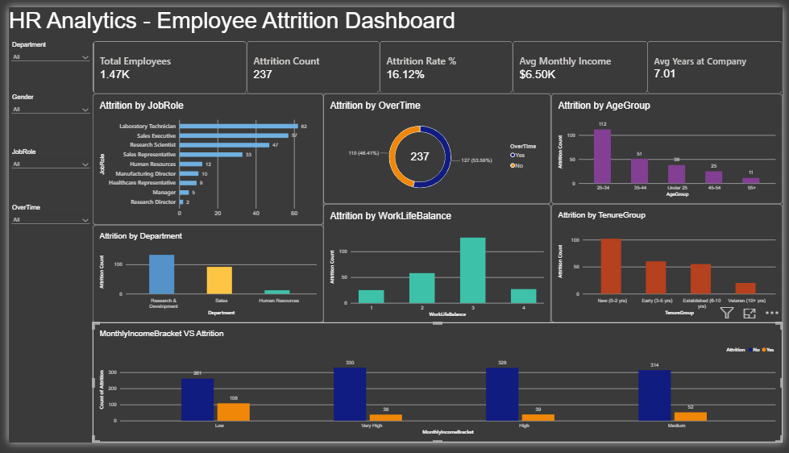
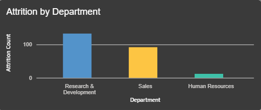
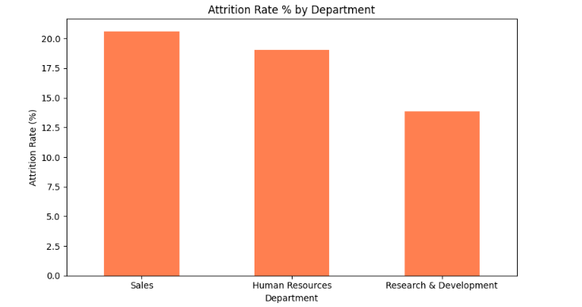
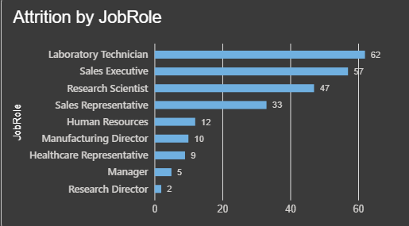
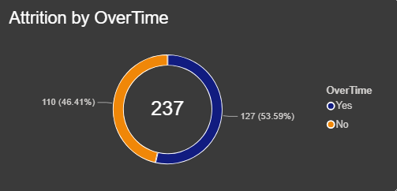
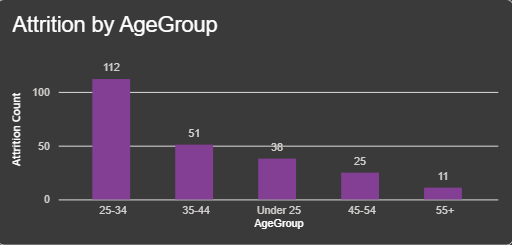
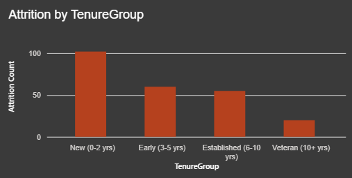
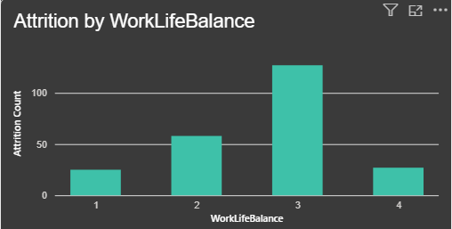
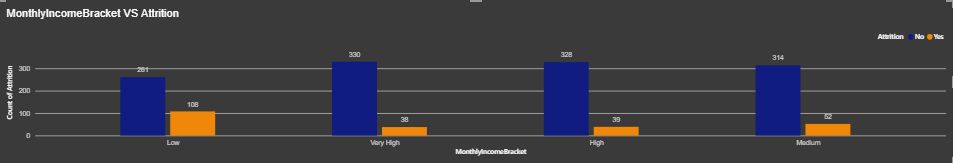
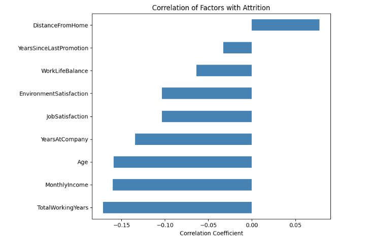

# HR Attrition Analysis Dashboard

## Executive Summary

Employee turnover is one of the most expensive and preventable problems a company can face — every departure means lost institutional knowledge, recruitment costs, onboarding time, and a productivity gap while the role sits open or a replacement ramps up. Yet most organizations only look at attrition *after* it happens, as a lagging metric on an HR slide.

This project takes a different approach: it treats 1,470 employee records as a dataset to be interrogated, not just summarized. The goal was to move past "16% of employees left this year" and get to "here's specifically who is leaving, why, and what the business can do about it before it happens again."

## The Story Behind This Project

Every year, companies lose good people — and often don't fully understand why until it's too late. This project digs into employee records spanning demographics, compensation, job satisfaction, tenure, and work patterns to answer a question every HR team wrestles with: **who is leaving, and why?**

What started as a straightforward attrition count turned into a much more specific picture — a single job role losing nearly 4 in 10 employees, single employees leaving twice as often as married ones, and frequent travelers walking out the door at 3x the rate of those who barely travel. Here's what the data revealed, step by step.

## The Dataset

- **Source:** [IBM HR Analytics Employee Attrition Dataset – Kaggle](https://www.kaggle.com/datasets/kapoorprakhar/ibm-hr-analytics-employee-attrition-enhanced)
- **Size:** 1,470 employees, 39 columns
- **Coverage:** Demographics (Age, Gender, Marital Status), job details (Department, JobRole, JobLevel, BusinessTravel), compensation (MonthlyIncome, PercentSalaryHike, StockOptionLevel), satisfaction metrics (JobSatisfaction, EnvironmentSatisfaction, WorkLifeBalance), and tenure history (YearsAtCompany, YearsInCurrentRole, YearsSinceLastPromotion)
- This breadth of fields is what makes the dataset useful beyond a simple headcount report — it allows attrition to be examined from multiple angles at once, rather than in isolation

## Tools Used

- **Excel** – Data validation and formatting
- **Power BI** – Dashboard building, DAX measures, interactive visualization
- **Python (pandas, matplotlib)** – Statistical analysis, correlation study, and deeper numerical comparisons

## Getting the Data Ready

The dataset came in clean — a quick audit confirmed **zero duplicates and zero missing values** across all 1,470 records, which is rare for real-world HR data and meant more time could go into analysis rather than cleanup.

That said, not everything in the raw data was useful. Three columns — **EmployeeCount, Over18, and StandardHours** — turned out to hold a single constant value across every single record. They were identified during the audit and excluded from analysis, since a column that never changes carries no analytical signal.

## The Dashboard

📄 [View Dashboard PDF](dashboard/hr_dashboard.pdf) (no Power BI needed)
📊 [Download .pbix file](dashboard/hr_dashboard.pbix) (interactive, needs Power BI Desktop)

**At a glance:**
| Metric | Value |
|---|---|
| Total Employees | 1,470 |
| Attrition Count | 237 |
| Attrition Rate | 16.12% |
| Avg Monthly Income | $6,502 |
| Avg Years at Company | 7.01 |

Roughly **1 in 6 employees** left the company. On its own, that number doesn't say much — a healthy company and a struggling one can both post similar overall attrition rates. The real story is in *which* 1 in 6 left, and what they had in common. That's what the rest of this analysis digs into.

## What the Data Revealed

### Some departments are bleeding people faster than others

**Sales (20.6%)** and **Human Resources (19.0%)** lose employees at nearly double the rate of **Research & Development (13.8%)** — even though R&D has the most people overall in the company. This matters because it rules out the easy explanation ("bigger teams naturally lose more people") — it isn't about headcount, it's about something specific to the day-to-day experience of working in Sales and HR roles that's pushing people out faster than elsewhere in the business.

### One job role stands out — and it's not a small gap

Breaking department-level attrition down further by specific job role revealed the sharpest finding in the entire analysis: **Sales Representatives leave at a staggering 39.8% rate** — nearly 4 in 10 people in this exact role. Compare that to **Laboratory Technician (23.9%)** and **Human Resources (23.1%)**, both already high, and then to the bottom of the list — **Research Director at just 2.5%** — and the range across roles is enormous. This isn't a department-wide problem; it's concentrated in a small number of specific, identifiable roles, which makes it a much more actionable target for intervention.

### Overtime is the loudest behavioral signal in the dataset

Employees who work overtime leave at **30.5%**, compared to just **10.4%** for those who don't — nearly **3x higher**. In HR analytics, it's rare to find a factor with this large and this clean a gap. Burnout isn't just a talking point here — it's showing up directly and consistently in the numbers, and it's arguably the single highest-leverage factor a company could act on.

### Frequent travelers and single employees are both flight risks
Two patterns emerged outside the dashboard that add real depth to the picture:

- **Business travel:** Employees who travel frequently leave at **24.9%**, more than **3x** the rate of those who don't travel at all (**8.0%**), with occasional travelers sitting in between (**15.0%**). Travel fatigue appears to be a genuine, measurable retention risk.
- **Marital status:** **Single employees leave at 25.5%** — roughly **double** the rate of married employees (**12.5%**) and **divorced employees (10.1%)**. This likely connects to the age and tenure patterns below: employees without the stability of a settled personal life may also be earlier in their careers and less anchored to a specific employer.

### Attrition has an age, and it's young

The **25-34 age group** shows the highest attrition activity of any age band, and employees in their **first 0-2 years** at the company are the most likely tenure group to leave. This lines up directly with the marital status finding above — younger, single, early-tenure employees form a consistent at-risk profile across almost every lens in this analysis.

### Money and work-life balance matter — quietly, but they matter

Employees in the **Low** income bracket leave at a noticeably higher share than those in Medium, High, or Very High brackets — compensation is clearly part of the retention equation, even if it isn't the loudest signal in the dataset.

Work-life balance tells a slightly more nuanced story: a rating of 3 shows the highest *raw count* of attrition, but that's mainly because most employees in the company happen to sit in that rating band — it's the most common score, not necessarily the riskiest one. Looked at proportionally, employees with the *lowest* WorkLifeBalance ratings (1-2) are actually the ones carrying higher relative risk, even though their raw numbers are smaller.

## Going Deeper with Python

Full notebook: [`notebooks/hr_analysis.ipynb`](notebooks/hr_analysis.ipynb)
               [`notebooks/hr_analysis.py`](notebooks/hr_analysis.py)

The Power BI dashboard is built for exploring the data visually and interactively — but some questions are better answered with statistics than charts. Python was used to run a correlation study and a direct group comparison to validate and deepen what the dashboard was already suggesting.

### What correlates with leaving?

Running a correlation check between key numeric fields and attrition confirmed the story the charts were already telling, but with statistical backing: **TotalWorkingYears** (-0.17), **MonthlyIncome** (-0.16), **Age** (-0.16), and **YearsAtCompany** (-0.13) all move in the same direction — more experience, more pay, and more tenure are consistently associated with a *lower* likelihood of leaving.

The one factor that flips the other way is **DistanceFromHome** (+0.08) — a small but positive correlation, meaning employees who live further from work are slightly more likely to leave. It's not a dominant factor on its own, but it's a reminder that logistics and commute burden are part of the retention picture too.

### Two very different employee profiles
| Metric | Stayed | Left |
|---|---|---|
| Avg Monthly Income | $6,833 | $4,787 |
| Avg Years at Company | 7.37 | 5.13 |
| Avg Age | 37.6 | 33.6 |
| Avg Total Working Years | 11.9 | 8.2 |

Lining these two groups up side by side makes the pattern concrete rather than abstract. The employees who left the company earn **roughly 30% less**, are **about 4 years younger**, and have **roughly 4 fewer years** of both company tenure and total work experience than those who stayed. This isn't a random cross-section of people leaving for personal reasons — it's a specific, identifiable, and *addressable* group.

## So What Should HR Actually Do?

Pulling all of this together, four actions stand out as the highest-impact places to start:

1. **Investigate the Sales Representative role specifically.** A 39.8% attrition rate in one role is not a coincidence — it points to something structurally wrong with that job (compensation structure, quota pressure, management, or career ceiling) that deserves a dedicated review, separate from broader department-level fixes.

2. **Address overtime head-on.** A nearly 3x attrition gap tied directly to overtime is too large a signal to treat as a footnote. Reviewing workload distribution, staffing levels, or introducing meaningful comp-time and overtime incentives could plausibly be the single highest-leverage retention move available in this dataset.

3. **Re-examine travel expectations.** With frequent travelers leaving at 3x the rate of non-travelers, the company should assess whether current travel demands are proportional to role needs, and whether travel-heavy roles need additional support or compensation to offset the burden.

4. **Invest in the first two years.** Since attrition clusters heavily around new, younger, single, lower-paid employees, the biggest opportunity may not be retaining long-tenured staff (who are already staying at high rates) but catching flight-risk employees early — through structured onboarding, mentorship pairing, and a visible, communicated path for early salary growth.

## Author

Khalid Khilji — Data Analyst

[LinkedIn](www.linkedin.com/in/khalid-khilji-4a4861435)

[Contra]()
